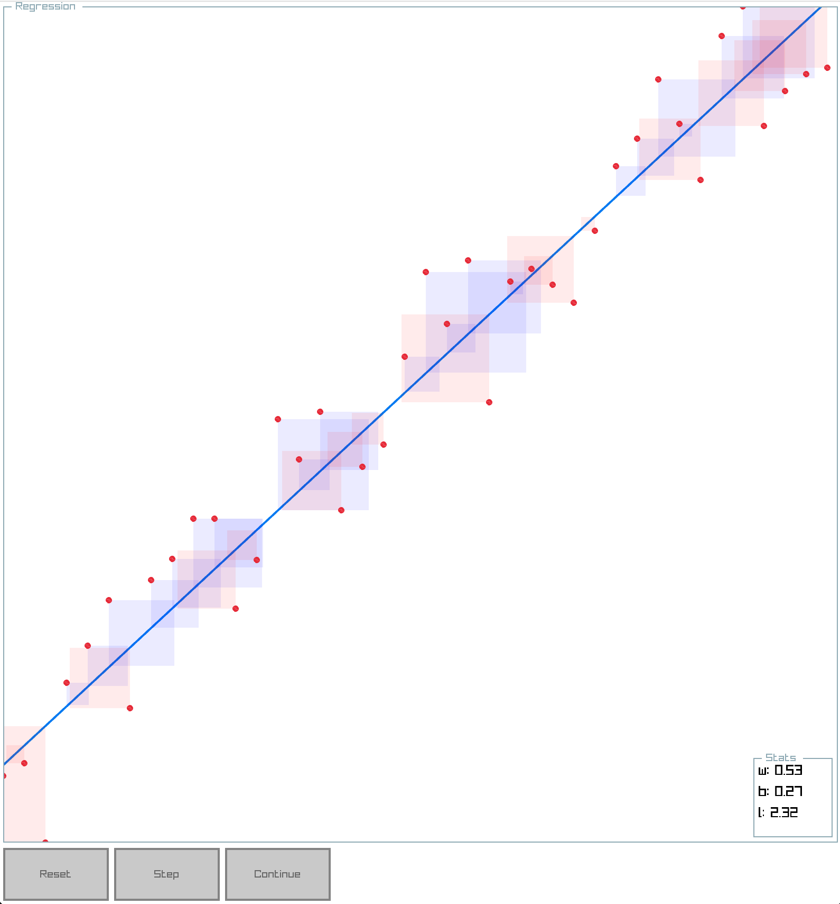

# Regression

## Setup

**This project has only been built and tested on MacOS so far, some dependencies and build commands might need to be changes for other systems**

Set up the project by running `make setup`, which will clone and build raylib. To build the project, run `make`, and run the executable found in the build directory

## Maths

For linear regressionThe loss function used is the [Mean Squared Error (MSE)](https://en.wikipedia.org/wiki/Mean_squared_error), which is defined as

$$
L_{MSE} = \frac{1}{n} \sum_{i = 1}^n (y_i - \hat{y}_i)^2, \text{ where } \hat{y} = \mathbf{w}^\top x_i + b
$$

The derivatives of the loss with respect to $\mathbf{w}$ and $b$ are

$$
\frac{\partial}{\partial \mathbf{w}}L_{MSE} = \frac{-2}{n} \sum_{i = 1}^n x_i(y_i - \hat{y}_i) \\
$$

$$
\frac{\partial}{\partial b}L_{MSE} = \frac{-2}{n} \sum_{i = 1}^n (y_i - \hat{y}_i)
$$

Therefore, the steps are defined as

$$
w_{i+1} = w_i - \alpha \frac{\partial}{\partial \mathbf{w}}L_{MSE} \\
b_{i+1} = b_i - \alpha \frac{\partial}{\partial b}L_{MSE}
$$
